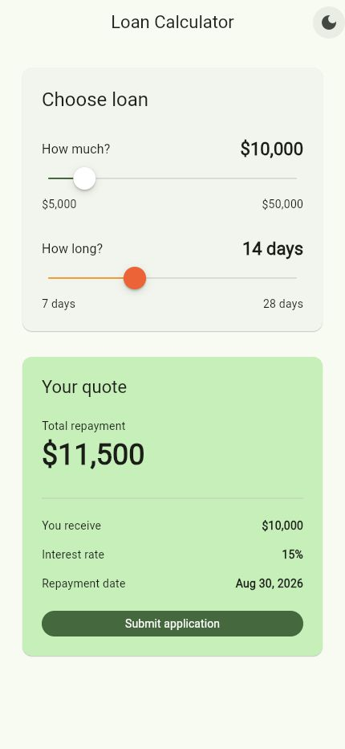
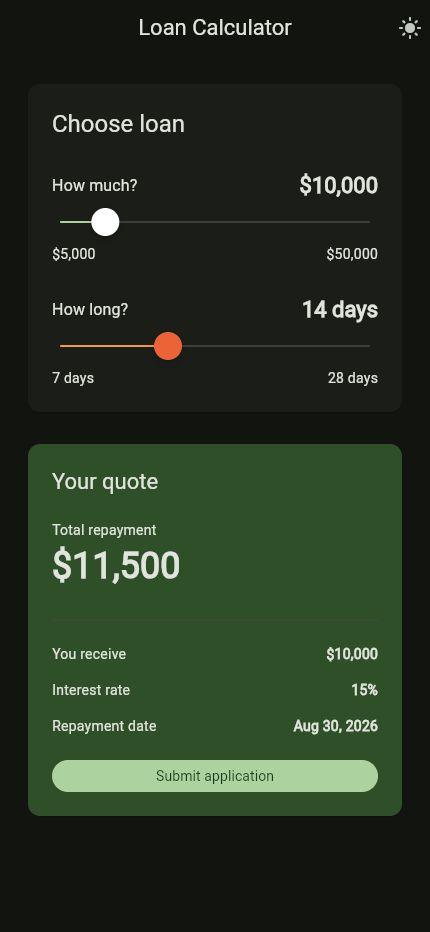
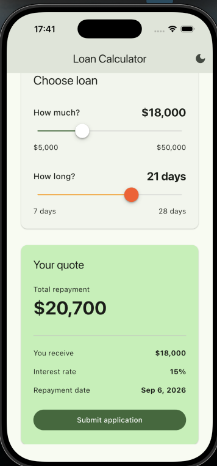
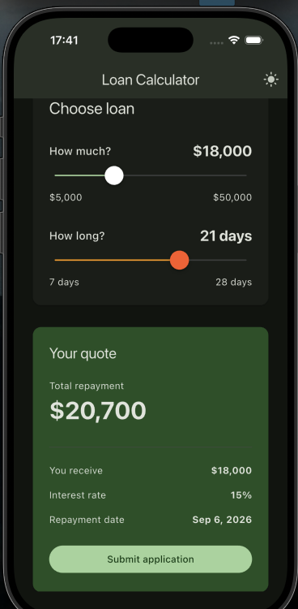

# Калькулятор займа

Простое Flutter-приложение для расчёта займа.

## Возможности

- выбор суммы от 5 000 до 50 000 USD;
- выбор срока: 7, 14, 21 или 28 дней;
- автоматический расчёт суммы и даты возврата;
- фиксированная ставка 15%;
- отправка заявки на тестовый API;
- состояния загрузки, успеха и ошибки;
- сохранение последнего выбора в SharedPreferences;
- светлая и тёмная темы с сохранением выбора;
- адаптивная вёрстка.

## Структура

Проект разделён на три слоя:

```text
lib/features/loan/
├── domain/        # модели, расчёт и интерфейс репозитория
├── data/          # HTTP и SharedPreferences
└── presentation/  # BLoC и экран
```

Зависимости регистрируются через GetIt в файле
`lib/dependency_injection.dart`.

## Запуск

```bash
flutter pub get
flutter run
```

## Проверка

```bash
dart format lib test
flutter analyze
flutter test
```

## API

Заявка отправляется POST-запросом на:

```text
https://jsonplaceholder.typicode.com/posts
```

Пример тела запроса:

```json
{
  "amount": 10000,
  "period": 14,
  "totalRepayment": 11500
}
```

## Скриншоты

### Android

| Светлая тема | Тёмная тема |
| --- | --- |
|  |  |

### iOS

| Светлая тема | Тёмная тема |
| --- | --- |
|  |  |

